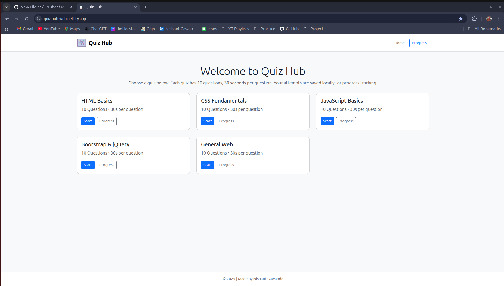
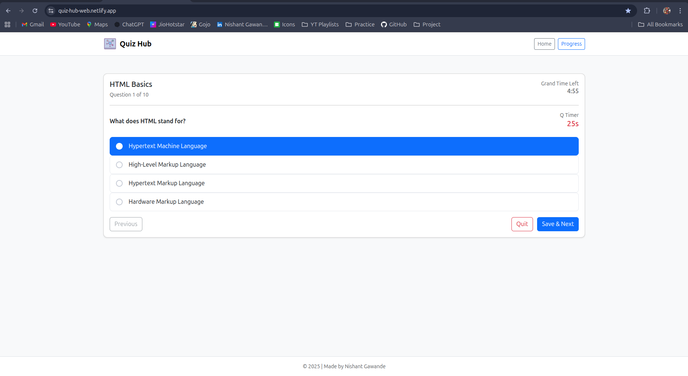
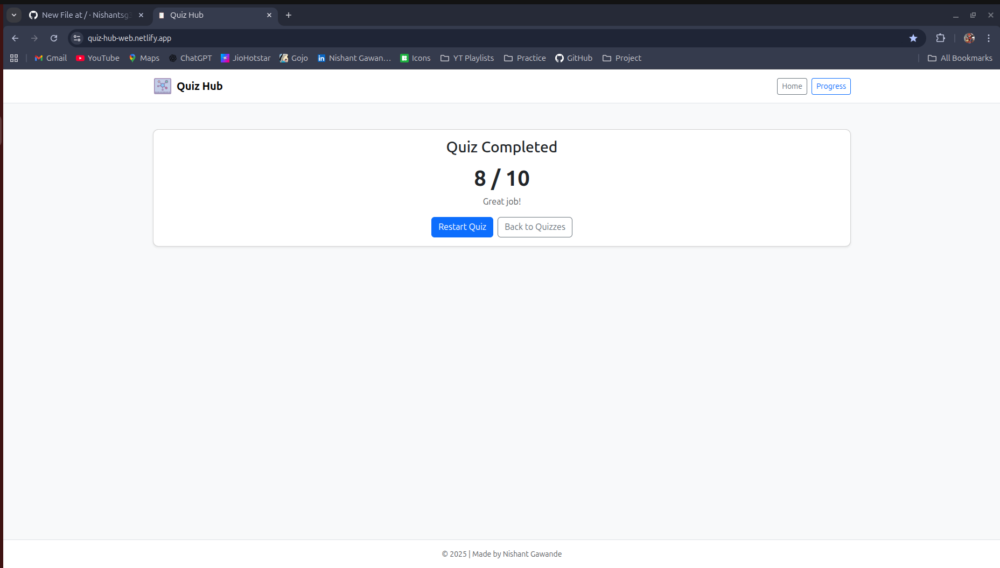
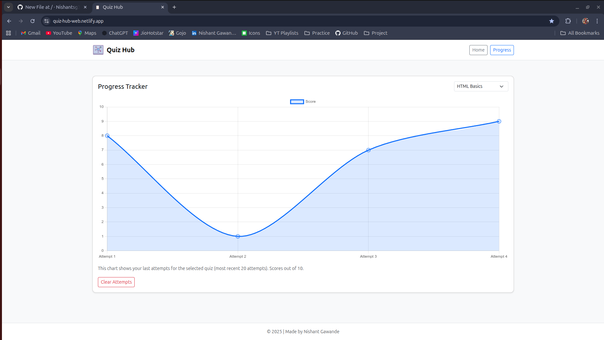

# 🎓 Quiz Hub

A professional, responsive **Quiz Web Application** built with **HTML, CSS, JavaScript, Bootstrap, and jQuery**.  
This project is portfolio-ready, designed to showcase frontend development skills with multiple quizzes, timers, and progress tracking.

🌍 **Live Demo** → [Quiz Hub on Netlify](https://quiz-hub-web.netlify.app)

---

## ✨ Features
✔️ 5 individual quizzes (HTML, CSS, JavaScript, Bootstrap, jQuery)  
✔️ 10 questions per quiz with instant feedback  
✔️ Responsive design for desktop & mobile using Bootstrap  
✔️ Countdown timer per question + grand quiz timer  
✔️ Score tracking with interactive line graph (Chart.js)  
✔️ Smooth UI interactions powered by jQuery  
✔️ Lightweight, fast, and deployable on Netlify  

---

## 🛠️ Tech Stack
- **HTML5** → Structure  
- **CSS3** → Styling & responsiveness  
- **JavaScript (ES6)** → Quiz logic & interactivity  
- **jQuery** → DOM manipulation & effects  
- **Bootstrap 5** → Layout & modern UI components  
- **Chart.js** → Graphs for quiz progress tracking  
- **Git & GitHub** → Version control  
- **Netlify** → Deployment & hosting  

---

## 📂 Project Structure
Quiz-Hub/
│── index.html # Main entry point
│── css/
│ └── style.css # Custom styles
│── js/
│ ├── script.js # Quiz logic & interactivity
│ └── data.js # Quiz questions & answers
│── assets/
│ ├── logo.png # App logo (used in UI)
│ └── favicon.png # Favicon for browser tab

---

## 📸 Screenshots

### Homepage  
  

### Attempt  
  

### Score  
 

### Progress  
 

---

## 🚀 Future Improvements
🔍 Add a global leaderboard system  
🌙 Dark/light theme toggle for better UX  
📱 Add quiz categories with difficulty levels  
📝 Enable saving results locally (LocalStorage)  
🎵 Add sound effects for correct/incorrect answers  

---

## 👤 Author
👨‍💻 **Nishant Gawande**  
📌 This project is for portfolio and learning purposes.  

🔗 GitHub: [@Nishantsg3](https://github.com/Nishantsg3)
🔗 Netlify: [@Nishantsg3](https://quiz-hub-web.netlify.app/)
⭐ If you liked this project, don’t forget to star the repo!  

